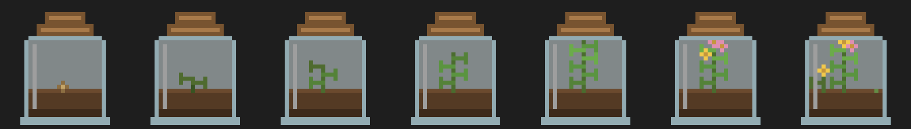

# Pomodoro Biome

A macOS Pomodoro timer where your focus sessions grow a little terrarium instead of just ticking down a clock.

Work a 25-minute session, then spend your 5-minute break tending to a biome in a jar — planting seeds, watering, adding nutrients — and watch it evolve from a single seed into a thriving ecosystem over time.



## Why

Existing Pomodoro + gamification apps (like Forest) are great, but this is a from-scratch, personal version with no subscription, running natively on macOS, and — eventually — a lot more depth: multiple biome types to unlock and small creatures that show up as the ecosystem matures.

## How it works

1. Start a 25-minute focus session.
2. When it ends, your biome earns 1 progress point and a 5-minute break begins.
3. During the break, spend points on optional actions (Plant a Seed, Water the Plant, Add Nutrients, Tend the Ecosystem) to grow the biome faster.
4. Every 5 points advances the biome to its next stage — 7 stages total, from bare Seed to a Thriving Ecosystem with flowers and a butterfly.
5. Everything persists locally (`~/.pomodoro-biome/data.json`) — close the app anytime, your progress is saved.

## Tech stack

- **Backend:** Rust + [Tauri 2](https://tauri.app/) — owns all game state, progression logic, and local JSON persistence
- **Frontend:** React + TypeScript + Vite — timer UI, biome rendering, break-action screen
- **Art:** Hand-coded 32x32 pixel art (see [`scripts/generate_biome_art.py`](scripts/generate_biome_art.py)), rendered crisp via `image-rendering: pixelated`
- **Tests:** `cargo test` for Rust progression/persistence logic, Vitest for frontend pure-function logic

## Getting started

Requires [Rust](https://rustup.rs/) and Node.js.

```bash
npm install
npm run tauri dev
```

To run the test suites:

```bash
cd src-tauri && cargo test   # Rust: progression + persistence logic
npm test                     # Frontend: time formatting + biome stage mapping
```

## Project structure

```
src/                  React frontend
├── components/       Timer, BiomeView, BreakActions, ProgressBar
├── pages/Main.tsx     Session lifecycle: idle -> working -> break -> idle
├── lib/               Types, Tauri command wrappers, pure logic + tests
└── assets/biome/      Pixel art sprites, one per biome stage

src-tauri/src/         Rust backend
├── game_state.rs      BiomeState / Session data model
├── progression.rs     Stage thresholds, action definitions, pure logic + tests
├── persistence.rs     Load/save to ~/.pomodoro-biome/data.json + tests
├── commands.rs        Tauri commands the frontend invokes
└── main.rs            App setup, managed state, save-on-quit

docs/superpowers/       Design spec and implementation plan this was built from
scripts/                Pixel art generation script
```

## Roadmap

The current build is a proof of concept (linear 7-stage progression, one biome type). Planned next:

- **Multiple biome types** — unlock forest, ocean, desert, etc., each with independent progression
- **Interactive ecosystem** — more creatures and finer-grained interactions as the biome matures
- **Real pixel art polish** — refine plant shapes, jar design, and animation on top of the current placeholder-turned-real sprites

See [`docs/superpowers/specs/2026-09-12-pomodoro-biome-design.md`](docs/superpowers/specs/2026-09-12-pomodoro-biome-design.md) for the full design rationale.

## License

Personal project — no license granted for reuse.
